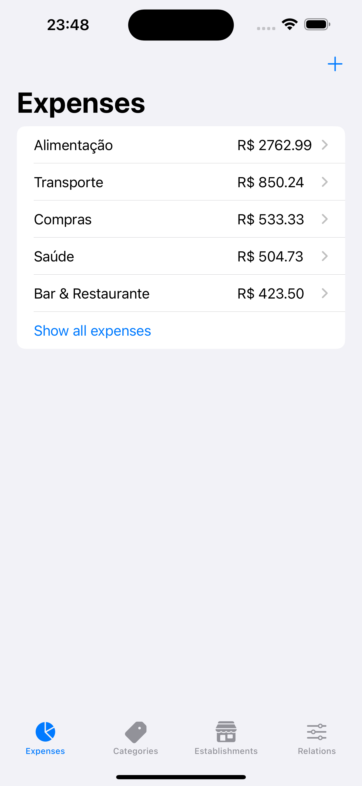
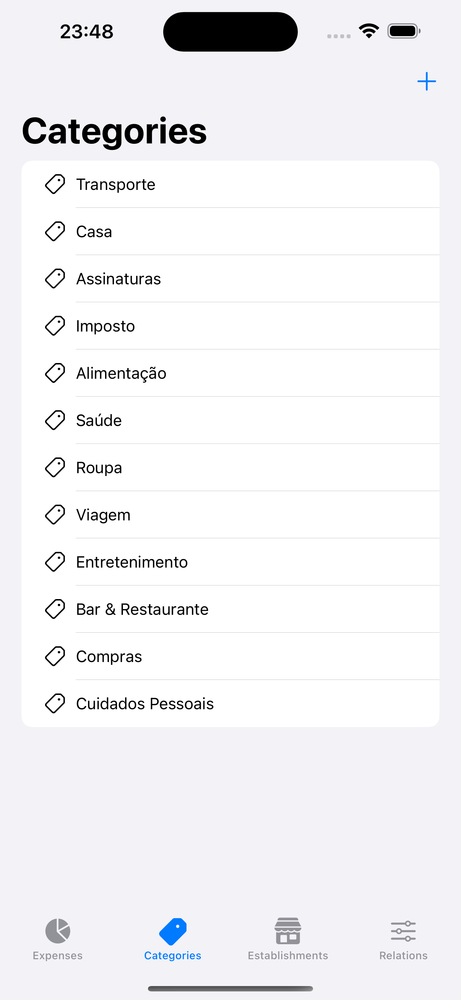

# Contalizze

Contalizze is a SwiftUI-based application that allows users to categorize their credit card purchases. It offers a simple and intuitive way to track and manage expenses, helping users better understand where their money is going and make more informed financial decisions.

    
    

## Key Features

- **Purchase Logging**: Users can log their credit card purchases by entering details such as purchase date, amount, and description.
  
- **Expense Categorization**: The app enables users to categorize their purchases into different categories, such as food, transportation, clothing, among others.

- **Expense Visualization**: Users can view a summary of their expenses by category and time period, making it easier to understand where more money is being spent.

## System Requirements

- iOS devices running iOS 14.0 or later.

## Installation

1. Clone or download the project repository.
2. Open the `.xcworkspace` file in Xcode.
3. Build and run the app on a simulator or iOS device.

## Usage

1. Upon opening the app, you will be directed to the main screen.
2. To add a new purchase, tap the addition (+) button at the top right of the screen.
3. Fill in the purchase details, such as date, amount, description, and category.
4. Tap "Save" to record the purchase.
5. To view your expenses by category, tap the "Expenses" tab at the bottom of the screen.

## Contributing

Contributions are welcome! If you wish to contribute to the project, follow these steps:

1. Fork the project.
2. Create your feature branch (`git checkout -b feature/MyFeature`).
3. Commit your changes (`git commit -am 'Add new feature'`).
4. Push to the branch (`git push origin feature/MyFeature`).
5. Open a Pull Request.

## License

This project is licensed under the [MIT License](https://opensource.org/licenses/MIT) - see the [LICENSE](LICENSE) file for more details.
